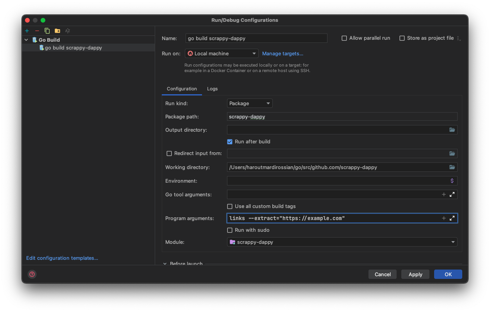

# Scrappy Dappy
#### Webpage URL scrapper - please read carefully before use
___
#### Task description
* *Create a service that gives the website as input from the array (inputData), get website by _website key, this means that you must scan any website (no matter what kind of website it will be, scan the whole site, not just the home page), merge each scanned website data into the array. When finished scanning the websites, display the result on the console.*
___
#### How to use
* Simple CLI application / service. The process can be executed either directly from the terminal or from the IDE
* Service has one command with flag
  * `cmd: links | flag: --extract`
  * `flag: --extract` accepts list of inputs. To pass multiple URLs just separate them with commas
* Default output type is **console**
___
#### Run using terminal
* Singe `go run main.go links --extract="https://example.com"`
* Multiple `go run main.go links --extract="https://example.com, https://example2.com"`

#### Run using GoLand IDE
* Add the command and flag into **Program arguments:** field 
